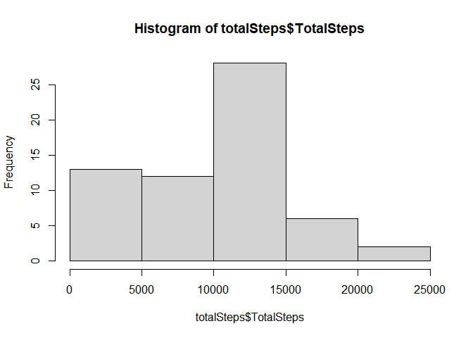
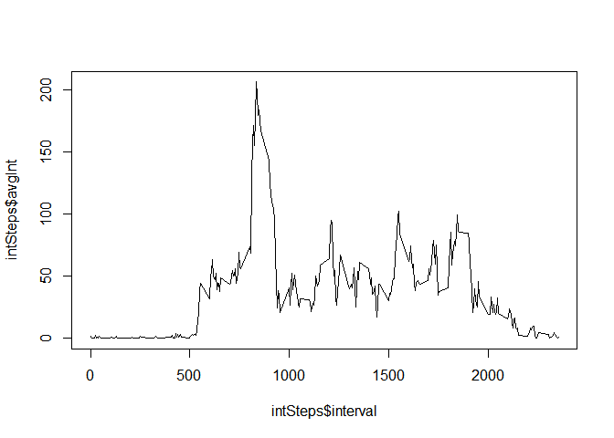
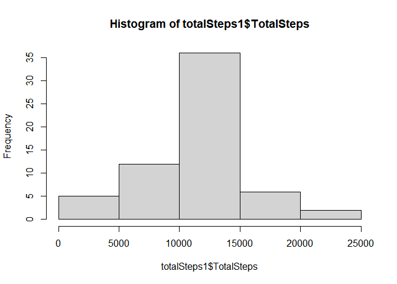
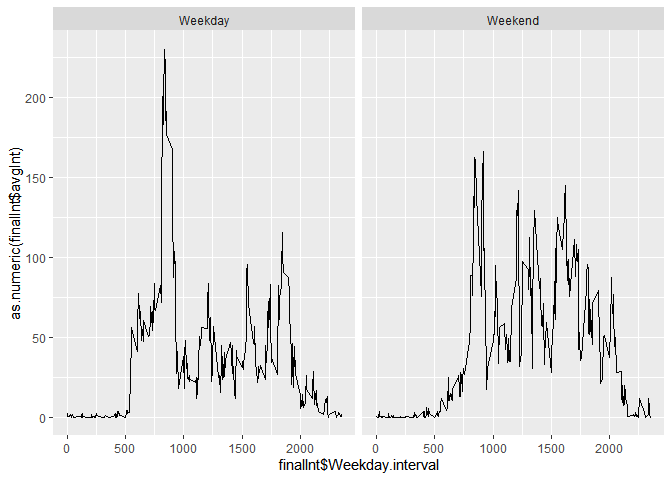

## Loading and preprocessing the data

```r
library(dplyr)
```

```
## 
## Attaching package: 'dplyr'
```

```
## The following objects are masked from 'package:stats':
## 
##     filter, lag
```

```
## The following objects are masked from 'package:base':
## 
##     intersect, setdiff, setequal, union
```

```r
library(ggplot2)
activity <- read.csv("activity.csv")
options(warn = -1)
```
In this step I am loading the dplyr package to help me later on as well as reading the activty datset into a dataframe.

## What is mean total number of steps taken per day?

```r
Stepsgroup <- group_by(activity, date)
totalSteps <- summarise(Stepsgroup, TotalSteps = sum(steps, na.rm = TRUE))
```

```
## `summarise()` ungrouping output (override with `.groups` argument)
```

```r
hist(totalSteps$TotalSteps)
```

<!-- -->

```r
meanSteps <- mean(totalSteps$TotalSteps)
medianSteps <- median(totalSteps$TotalSteps)
#Mean
print(meanSteps)
```

```
## [1] 9354.23
```

```r
#Median
print(medianSteps)
```

```
## [1] 10395
```


## What is the average daily activity pattern?

```r
IntervalGroup <- group_by(activity, interval)
intSteps <- summarise(IntervalGroup, avgInt = mean(steps, na.rm = TRUE))
```

```
## `summarise()` ungrouping output (override with `.groups` argument)
```

```r
plot(intSteps$interval, intSteps$avgInt, type= "l")
```

<!-- -->


## Imputing missing values

```r
numNa <- is.na(activity)
trueTotal <- sum(numNa == TRUE)
#Number of Missing Values
print(trueTotal)
```

```
## [1] 2304
```

```r
#Filling in NAs
activityFill <- activity
for(i in 1:length(activityFill$steps)){
    if(is.na(activityFill$steps[i]) == TRUE){
        interval <- activityFill$interval[i]
        rowNum <- grep(as.character(interval), intSteps$interval)
        val <- intSteps$avgInt[as.numeric(rowNum)]
        activityFill$steps[i] <- val
    }
}

#Total Steps taken per day
Stepsgroup1 <- group_by(activityFill, date)
totalSteps1 <- summarise(Stepsgroup1, TotalSteps = sum(steps, na.rm = TRUE))
```

```
## `summarise()` ungrouping output (override with `.groups` argument)
```

```r
hist(totalSteps1$TotalSteps)
```

<!-- -->

```r
meanSteps1 <- mean(totalSteps1$TotalSteps)
medianSteps1 <- median(totalSteps1$TotalSteps)
#Mean
print(meanSteps1)
```

```
## [1] 10766.19
```

```r
#Median
print(medianSteps1)
```

```
## [1] 10766.19
```


## Are there differences in activity patterns between weekdays and weekends?

```r
weekday <- weekdays(as.Date(activityFill$date))
activityFill <- cbind(activityFill, weekday)

for(i in 1:length(activityFill$weekday)){
    if(activityFill$weekday[i] == "Saturday" | activityFill$weekday[i] == "Sunday"){
        activityFill$weekday[i] = "Weekend"
    }
    else{
        activityFill$weekday[i] = "Weekday"
    }
}

activitySplit <- split(activityFill, activityFill$weekday)

actDay <- as.data.frame(activitySplit[1])
actEnd <- as.data.frame(activitySplit[2])

actDayInt <- group_by(actDay, Weekday.interval)
intDay <- summarise(actDayInt, avgInt = mean(Weekday.steps))
```

```
## `summarise()` ungrouping output (override with `.groups` argument)
```

```r
day <- rep("Weekday", length(intDay$avgInt))
intDay <- cbind(intDay, day)

actEndInt <- group_by(actEnd, Weekend.interval)
intEnd <- summarise(actEndInt, avgInt = mean(Weekend.steps))
```

```
## `summarise()` ungrouping output (override with `.groups` argument)
```

```r
End <- rep("Weekend", length(intEnd$avgInt))
intEnd <- cbind(intEnd, End)

names(intEnd)[1] <- c("Interval")
names(intEnd)[3] <- c("Day")

names(intEnd)[1] <- names(intDay)[1]
names(intEnd)[3]<- names(intDay)[3]

finalInt <- rbind(intDay, intEnd)

qplot(finalInt$Weekday.interval, as.numeric(finalInt$avgInt), facets = ~finalInt$day, geom = "line") 
```

<!-- -->
